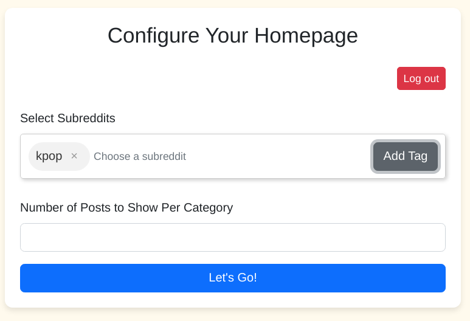

# Distraction free reddit guide

# What is Reddit?
* Reddit is a social media website, where users can post multimedia content to forums of a particular topic (subreddits), and other users can vote and comment on the post.
    
* Posts are moderated by volunteers, and are voted by users of the subreddit to be either relevant or irrelevant to the Subreddit rules.

* It is simple to use and allows users to stay up to date with their hobbies / news.
    
* In this app that we are using, I am retrieving the top voted content from the past 24h from the subreddits selected.

# Why I created this app
* Reddit is a great way of viewing topics / categories that are relevant to you.
* We are able to curate our own homepage by creating an account and subscribing to subreddits.
* However, like most people who are active on social media, I get sucked into discussions and the infinite pool of content that is available on the internet.
* What this app aims to do is to utilize the customizability of reddit to keep up with their interests.
    * The number of posts to display has been limited to 10, with a maximum of 5 subreddits to make sure that the user does not spend too much time on the site.
    * The comment section has been excluded from the site, but there is a link if the user wants to visit the site, creating an intentional inconvenience for the user to discourage mindless content consumption
    * Posts are sorted by the top posts of the day, thus ensuring that the is quality control to the post relevance.
    * Users will be sent to their home page directly where their posts will be displayed so they can get straight to their posts. 

# How to use
* Test out if the subreddits exist (if there's no error message it probably does)
* During your first log in, you will be directed to the customization page:
* **Select subreddits** by pressing **Enter** after keying the name of the subreddit you want to add to your home page.

    
    
* **Choose the number of posts** you would like to view per subreddit (There might be less posts that selected here if the subreddit is not active)

    
    
* Let's Go!
* At the home page, you are able to see the post at a glance, and you can click view Post to access the webpage.
* You can always go back to the configuration page if you want to change your subreddits.

## Links
The api documentation can be found here: [Reddit Api Documentation](https://www.reddit.com/dev/api/#GET_{sort})

